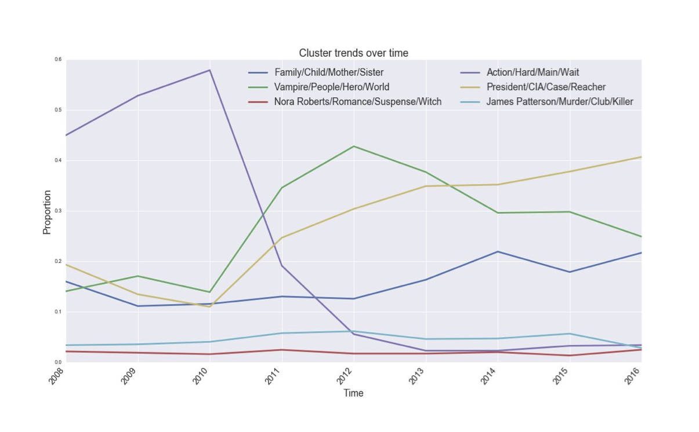

Title: Fiction trends project. Part I: Overview 
Date: 2017-01-22 08:00 PM 
Modified: 2017-01-22 08:00 PM 
Category: Projects 
Tags: Natural Language Processing 
Authors: Sally Mit.
Summary: This post is about the capstone project I developed during Data Science Immersive program at Galvanize 

# Overview 

Every month Amazon Kindle Direct Publishing sends a newsletter to its indie authors with news, updates, interesting articles, and success stories to encourage authors to write and publish more. The success stories are fascinating and inspiring, but authors don’t always know which types of books sell well and which don’t, so every success story just seems to be pure luck. In this project I applied data science to report on the trends of the publishing world over the years. The end goal is to help authors who want to make a living with their writing make informed writing decisions.

# Data

Data collection and cleaning (in a never ending loop) took most of the two weeks alloted at the end of the course for the project. It involved reaching out to several people in hopes of easily obtaining the data, and when that failed -- scraping New York Times for historic bestseller lists, scraping Goodreads for descriptions and reviews of books on the lists and extracting several thousand reviews out of millions in the Amazon data dump from a few years ago for the Stanford study. I learned about parsing pdfs (hint: it’s a pain in the neck!), pros and cons of APIs, web-crawling, and merging of all the data.

I was hoping to go way back in time with the books, but after a lot of trial and error was forced to stick to the recent lists history, from 2008 to present, in order to meet project requirements and have time to make an MVP. My biggest lessons at this point were about trying many things in quick succession on a small scale before unleashing them on the whole huge dataset, not forgetting to check the results to avoid nasty surprises (got many of those *sigh*), and not getting hung up on trying to fix things that. Just. Don’t. Work.

# Analysis

After settling on the data I was going to use, I moved on to my analysis strategy. This was a LOT easier than collecting the data had been. Using python’s nltk package I tokenized my descriptions and reviews, removed stop words, and vectorized what was left based on term and document frequencies, using tf-idf. I then fed the output to scikit-learn’s non-negative matrix factorization (NMF) module to extract topics out of the available text. After that I used the scikit-learn k-means clustering algorithm to cluster books based on the topics obtained in the previous step.

This took a little bit of trial and error. While clustering, I discovered that my vectorizer considered words such as ‘book’, ‘author’, ‘novel’, ‘series’, ‘read’ (and several others that included URLs) important, while they were not actually very useful when eye-balling the topics. I ended up tinkering with the models by adding some words to the stop-words list, tweaking the number of topics to be extracted, and slightly changing the way clusters were calculated.

# Results

The results were pretty fascinating! My model came up with 6 clusters which included:

* family, life, mother, year, home, mallery,  town, child, sister, carr
    * e.g., THREE SISTERS by Susan Mallery
* want, see, say, doe, world, feel, vampire, come, people, hero
    * e. g., ALL I WANT FOR CHRISTMAS IS A VAMPIRE by Kerrelyn Sparks
* higgins, barrington, john, reacher, logan, president, case, cia, johansen, clark
    * e. g., LEAN MEAN THIRTEEN by Janet Evanovich
* line, keep, hard, however, every, main, action, lot, wait, start
    * e.g., YOUR HEART BELONGS TO ME by Dean Koontz
* nora, robert, romance, suspense, witch, brother, ireland, evil, parker, six     
    * e.g., CHARMED AND ENCHANTED by Nora Roberts
* patterson, james, cross, alex, murder, private, club, killer, case, michael    
    * e.g., CROSS FIRE by James Patterson

Hmm.

Turns out the ‘action’ cluster peaked in 2010, and then experienced a very sharp decline. This cluster included books about zombies, virus outbreaks and general world calamities. 

Vampire cluster included all kinds of vampire books as well as others in the paranormal (mostly romance) genres. Ugh. All these undead creatures are *finally* dying. 

What looks to be really on the rise are detective stories, spy novels and psychological thrillers (Girl on the Train, anyone?). Friend/family genre seems to be doing quite well, too.

Here is a plot of these clusters to help you see:

But look at the two boring ones at the bottom! These are the ‘Nora Roberts’ and ‘James Patterson’ clusters. Yes. These two authors each got their own cluster. While they don’t have any crazy ups and downs between 2008 and 2016, these two have steadily been on the bestseller lists for the eight years of data that I was able to gather. My clusters are far from perfect as you can probably tell from the words which were considered descriptive of some of them, but my model INSISTED (no matter how many different ways I tried to run it) that Nora and James be their own clusters. Nora’s cluster had 50 books, 46 of which were by her. 1 was by J.D. Robb, who, in case you didn’t know, is Nora in disguise :)

# Future work

As I only had two weeks to complete this project, there were lots of things I had to cut in order to fit the timeline. Here are some plans I have for the future:
1. Obtain more bestseller lists from New York Times (pdf parser, I’ll be back!) and other organizations such as Publishers Weekly, USA Today, etc. This can hopefully include a larger variety of books and be more interesting overall because of more historic data.
2. Use numerical data, such as actual ranking of books on the lists, in analysis. So far I only analyzed the textual part of my data, but I suspect that including current and past numeric ranking of books and number of weeks on each book was present on the list in my analysis would lead to more accurate trends and better clustering.
3. Include other textual data, such as character descriptions of books, reviews from blogs and newspapers, tweets and other social media. This would create a more complete picture of every genre and would reveal what people like/hate about certain characters, setting, plots, themes, etc.
4. Make a web-app to process new data in real, or close to real, time. I’m hoping to create something that can be accessed any time with most recent information and trends available at a few clicks. Also, an app can make it easier to interpret all the interesting findings of my models without having to rely on somewhat confusing plots. 

# Conclusion

All in all, this was a fun and highly educational experience for me. Things I’ve learned are:
1. Planning matters. It is easier to complete a project when you have a plan, even a bad one.
2. Trial and error on small parts first will prevent you from having to clean up a big mess later.
3. Tmux is your friend! I had to get reviews for about 3000 books from Goodreads. Trust me. Tmux is the best thing in the world.
4. Always be commiting!!! Learned this the hard way. Nearly lost a huge chunk of my data. The only thing that saved me was printing that data to the console two minutes before accidentally deleting the file.
5. Write more and be your own cluster! This is not a data science lesson, but still an important one for those of us who like to write :)
In the next post I will describe my battles with data collection and cleaning for this project.

Until then!
